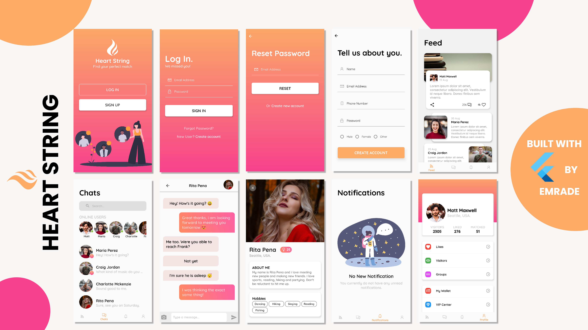

# Flutter Social (Heart String) - A UI for a Social Media App 

A Flutter UI implementation of a social media application

Star this repo if you like what you see.

## 📸 Screenshots

 
   

## Author(s)
**Emmanuel Fache**

## Getting Started

**Note**: Make sure your Flutter environment is setup.
#### Installation

In the command terminal, run the following commands:

    $ git clone https://github.com/emrade/flutter-social.git flutter_social
    $ cd flutter_social/
    $ flutter packages get
    $ flutter run

##### Check out Flutter’s online [documentation](http://flutter.io/) for help getting started with your Flutter project.
